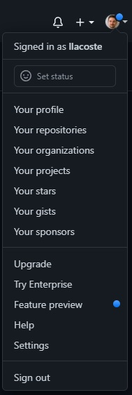
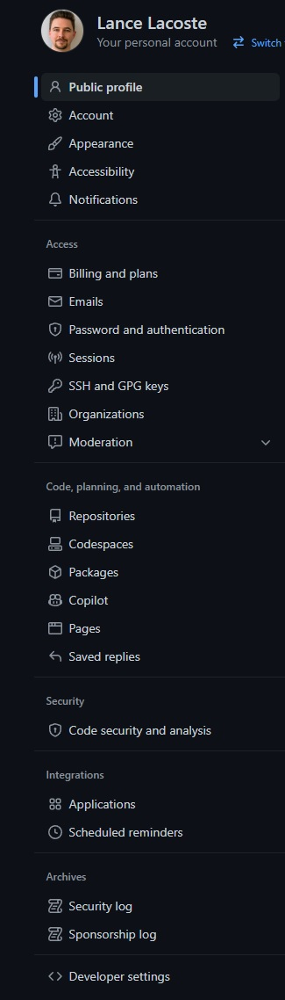
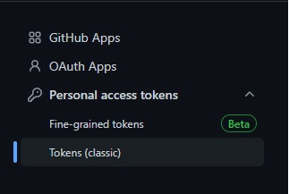
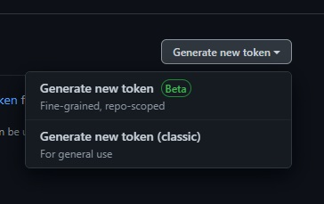

# Github

## Generating Credentials to use with Jenkins

- Log into Github

- Select your profile at the top right and then `Settings`

- Select `Developer Settings` on the bottom left

- Select `Personal access tokens` and then `Tokens (classic)`

- Select `Generate new token` at the top right and then `Generate new token Beta`

- Fill out the following:
    - Token name: Jenkins
    - Expiration: 90 days
    - Description: Something appropriate
    - Select `Only select repositories` and then select your project repository
    - Under `Permissions` give `Read and Write` to the following:
        - `Code scanning alerts`
        - `Commit Statuses`
        - `Contents`
        - `Merge queues`
        - `Pull requests`
        - `Repository announcement banners`
        - `Webhooks`

- Select `Generate token`

- Save the token somewhere safe, you will not be able to view it again.

