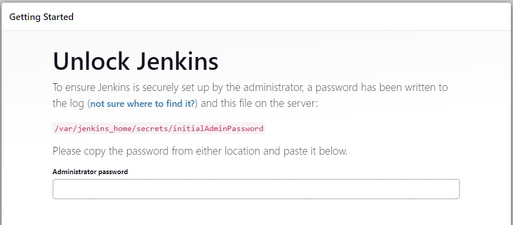
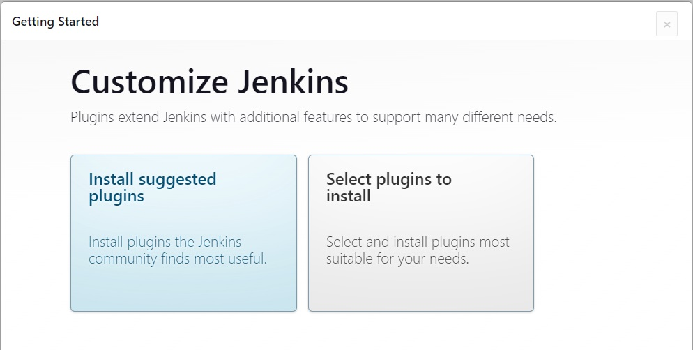
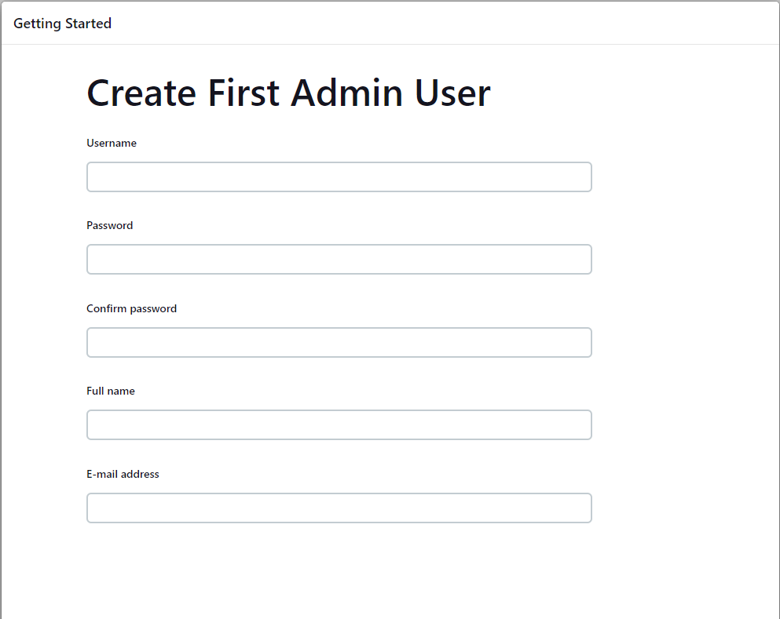
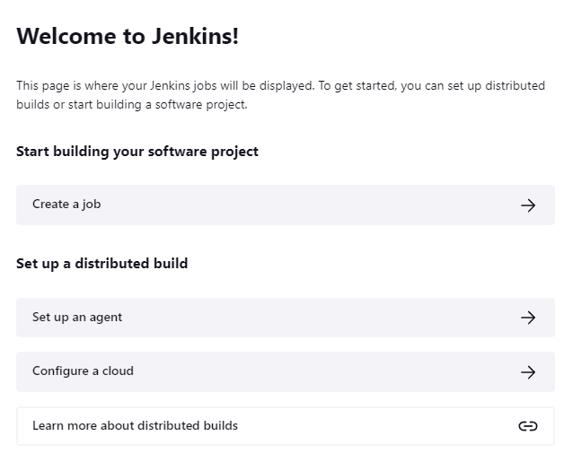
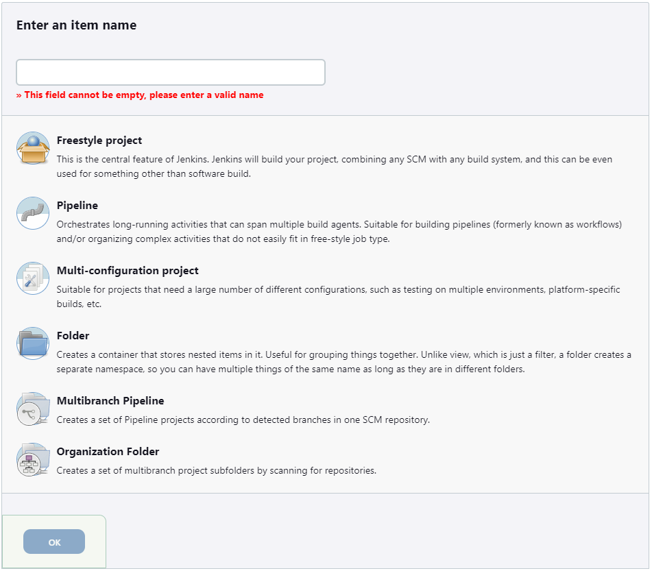

# Jenkins

## Building Jenkins

```bash
docker build -t jenkins-docker .
```

## Starting Jenkins

```bash
docker run -it -p 8080:8080 -p 50000:50000 -v /var/run/docker.sock:/var/run/docker.sock -v $(pwd)/jenkins_home:/var/jenkins_home jenkins-docker
```

## Get the password

This should be presented after running, but you can always find it with the following command.

```bash
cat jenkins_home/secrets/initialAdminPassword
```

## Initial Setup of Jenkins

1. Navigate to [http://localhost:8080](http://localhost:8080) you should be presented with the following:



2. Log in with the password above and you should be presented with the following:



3. Select `Select plugins to install`

4. In addition to what is already selected, install the following:
    - HTML Publisher
    - Github plugin

5. Select install at the bottom right Jenkins will install the plugins and then present you with the following:



6. Fill out the form and then select `Save and Continue`

7. Accept the url and continue then click `Start using Jenkins`

8. Congratulations! Jenkins is up and running!

## Setup of Jenkins

1. Install Docker by selecting `Manage Jenkins` then `Manage Plugins`. Select `Available Plugins` search for `Docker`. Select both `Docker` and `Docker Pipeline`. Finally select `Install without restart`.

2. (Optional) Install `Blue Ocean` by selecting `Manage Jenkins` then `Manage Plugins`. Select `Available Plugins` search for `Blue Ocean` and select `Blue Ocean`. Finally select `Install without restart`.


## Setup your pipeline

1. Select `Create a job`



2. You will be presented with the following:



3. Enter the name of your repository, select `Multibranch Pipeline`, and click `OK`

4. Under `Branch Sources` select `Add source` then select `Github`

5. For `Credentials` select `+ Add` then select `Jenkins`

6. Fill out the form with the following:
    - Domain: `Global credentials`
    - Kind: `Username with password`
    - Scope: `Global`
    - Username: `Jenkins`
    - Password: The token you generated from Github
    - ID: Leave blank
    - Description: Something appropriate

7. Save the credentials. Make sure these new credentials are selected.

8. Enter your repository URL in `Repository HTTPS URL` then click `Validate` to make sure you have access.

9. Under behaviors select `Add` and then select `Checkout over SSH`.

10. In the new section that pops up select `Add` then select `Jenkins`.

11. Fill out the form with the following:
    - Domain: `Global credentials`
    - Kind: `SSH Username with private key`
    - Scope: `Global`
    - Private Key: Select `Enter Directly` and then paste your ssh private key.

12. Select `Add` and then make sure these credentials are selected.

13. Under `Scan Repository Triggers` select `Periodically if not otherwise run` and then select your desired period. Normally, you would set up webhooks to post to your Jenkins instance to notify Jenkins that a commit has been made. This will allow Jenkins to query Github to see if new commits have been made every period.

13. Select `Save` at the bottom of the page to save you configuration.

Jenkins will scan the repository for braches that have a `Jenkinsfile` and then automatically build these branches.